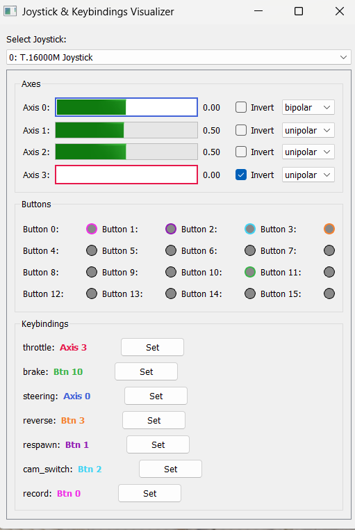

# NEED 4 CARLA HOT PURSUIT

## Project Overview

This repository provides a data‐collection and scene‐graph generation framework for human driver behavior in the [CARLA simulator](https://carla.org/).

**Key Objectives:**
* **Behavior Analysis**: Capture throttle, braking, steering, and camera interactions of a human operator to build a rich dataset of realistic driving patterns.
* **Scenario Recreation**: Reproduce and analyze traffic incidents (near-misses, collisions) by replaying human-driven trajectories in a controlled simulation environment.
* **Scene Graph Extraction**: Automatically generate spatial and relational graphs of scene entities (vehicles, lanes, signs) synchronized with control inputs.

## Repository Structure
Below is the top-level folder structure of this project:
ROOT/  
├── CARLA/  
│   ├── CARLA_0.9.14/ #  Required; other versions optional  
│   └── CARLA_0.9.15/  
├── carla_scene_graphs/ # <- Submodule: https://github.com/less-lab-uva/carla_scene_graphs.git  
├── hse/  
│   ├── examples/  
│   │   └── run.py # <- Starting app here  
│   ├── control_panel.py  
│   ├── carla_connector.py  
│   ├── controller_manager.py  
│   ├── data_manager.py  
│   ├── ui_builder.py  
│   └── utils/  
│       ├── settings.py  
│       ├── paths.py  
│       └── joystick_visualizer.py  
├── requirements.txt  
└── README.md # You are here  

## Scene Graph Generation Library

We integrate the [carla_scene_graphs](https://github.com/less-lab-uva/carla_scene_graphs) library to process simulation state into relational graphs of entities, lanes, and interactions. The Control Panel UI automates cloning or updating this repo via the **Pull SGG** action.

---

## Installation

Follow the steps below to set up and run the application.

### 1. Clone the Repository

```bash
# Change into your desired workspace and clone the project
git clone https://github.com/codergod1337/Studienprojekt.git
cd Studienprojekt
```

### 2. Create & Activate Conda Environment

```bash
# Create a new Conda environment named "carla" with Python 3.7
conda create -n carla python=3.7 -y
# Activate the environment
conda activate carla
```

### 3. Install Dependencies
this includes the dependencies for the SGG repo

```bash
# Install required Python packages
python -m pip install --upgrade pip setuptools wheel
# install the correct PyTorch version first! ESPECIALY FOR WINDOWS USERS
pip install torch==1.10.1+cu113 torchvision==0.11.2+cu113 --extra-index-url https://download.pytorch.org/whl/cu113

pip install -r requirements.txt


linux:
pip install pycocotools
#pycocotools==2.0.3

windowsuser extra command:
pip install pycocotools-windows
```

### 4. Download and extract CARLA Simulator

1. Download CARLA 0.9.14 to the `ROOT/CARLA` directory (in the project root, create if not there).  
https://carla.readthedocs.io/en/latest/download/  
https://github.com/carla-simulator/carla/releases/tag/0.9.14/  
2. extract the ZIP file in this directory `ROOT/CARLA/CARLA_0.9.14/*` use the default subfolder name `CARLA_0.9.14` or the version selection will not work.

### 5. Initial App Launch

1. connect Controller Device (Joystick) to your PC and install drivers
2. start App:
```bash
python hse/examples/run.py
```
3. make sure there is no carla_scene_graphs folder in your root directory. Otherwise the necessary repo is not able to be cloned by the app.
4. in the App: click file/pull SGG
-> in the Groupbox Scene Graph Generator status is supposed to switch to SGG ready
this is only necessary ONCE! you can click it again to update (git pull) the SGG-Repo


# User Interface (UI)
- **Purpose:**  
  Provides an intuitive frontend for the user to interact with the simulator and underlying modules without touching code.


- **Responsibilities:**  
  - **Connection panel:**  
    - Input fields for CARLA host/port/version  
    - “Connect” button that invokes `CarlaConnector.connect()`  
    - Status indicator showing “Connected” / “Disconnected”  
  - **Vehicle controls:**  
    - Dropdown to select a vehicle blueprint (populated via `blueprints_loaded` signal)  
    - “Spawn” button that calls `CarlaConnector.spawn_vehicle()`  
    - Live display of the last-spawned vehicle’s ID or type  
  - **Camera view selector:**  
    - Dropdown or radio buttons listing available views (e.g. bird’s-eye, cockpit, free)  
    - Emits `set_camera_position` when changed  
  - **Recording controls:**  
    - Toggle button for Start/Stop recording (wired to `start_recording()` / `stop_recording()`)  
    - Frame count display updated via `frame_recorded` signal  
  - **Joystick visualizer widget:**  
    - Embedded view showing axis positions and button states in real time  
    - Option to enter “rebind” mode to capture a new button or axis for a control function  
      
  - **menu: file/ pull SGG**  
    - pulls the Scene Graph Repo  
  - **menu: CARLA/**  
    - after connecting to Carla the vehicle model (blueprint) can be selected  
    - the camera position can be chosen
  - **menu: controls**  
    - the JoystickVisualizer is started as a widget and can be used for Key-Bindings
    - the active "Hardware-Input-Device" can be selected
 

- **Behavior:**  
  - All GUI actions emit Qt signals or call slots on `CarlaConnector` and `ControllerManager`.  
  - On window close (`closeEvent`), it  cleans up all threads.  


# Quick Module Description

## utils/settings.py
Default values such as paths can be changed here.

## CarlaConnector
- **Purpose:**  
  Manages the connection to the CARLA simulator and drives the simulation loop in its own thread.  
- **Responsibilities:**  
  1. Dynamically import CARLA’s Python API based on your selected version in `initialize_connection()`.  
  2. Connect to the CARLA server and enable synchronous (“fixed‐tick”) mode.  
  3. Run `_run()` in the background, which kicks off `_simulation_loop()`.  
  4. Spawn vehicles on demand (processing “spawn” commands from a queue).  
  5. Fetch control inputs from `ControllerManager` and apply them to the most recently spawned vehicle.  
  6. Adjust the spectator camera based on your chosen view.  
  7. Use a thread pool for `_record_worker` tasks, allowing multiple scene‐graph (SGG) snapshots to be generated and saved in parallel.  

more details in [CarlaConnector README](hse/docs/carla_connector_README.md)

## ControlPanel (GUI)
- **Purpose:**  
  The central user interface that ties everything together.  
- **Responsibilities:**  
  - Visualize the current state of `DataManager`, `ControllerManager`, and `CarlaConnector`.  
  - Offer buttons, dropdowns, and status indicators for connecting, spawning, recording, etc.  
  - Override `closeEvent` to orchestrate a clean shutdown of all background threads and resources.

more details in [ControlPanel README](hse/docs/control_panel_README.md)  

## ControllerManager
- **Purpose:**  
  Reads joystick or gamepad input continuously in a background thread (powered by `pygame.init()`).  
- **Responsibilities:**  
  - Poll hardware controls and map raw axes/buttons into named control functions (e.g. `"throttle"`, `"brake"`, `"respawn"`).  
  - Expose `get_mapped_controls()` to return only the controls you’ve explicitly bound.  
  - Provide `get_all_states()` for debugging, which dumps every axis and button value to the console.  
- **Bonus:**  
  Can run standalone in debug mode to print all joystick activity.

more details in [ControllerManager README](hse/docs/controller_manager_README.md)  

### JoystickVisualizer
- **Purpose:**  
  A small UI helper that shows your current control mappings in real time.  
- **Responsibilities:**  
  - Display which axis or button is mapped to which function.  
  - Let you assign or rebind controls on the fly.


## DataManager
- **Purpose:**  
  Persists the application’s state (e.g. host, port, selected vehicle model, key bindings) in a `data/state.json` file and reloads it on startup.  
- **Responsibilities:**  
  - Load saved settings to restore the previous session.  
  - Let any other class save or retrieve arbitrary key–value pairs.


# Troubleshooting
- delete `data/state.json` so default values are loaded from settings.py
- clone carla_scene_graphs manually
- after the first key binding make sure to connect to carla, sometimes the changes are not saved otherwise
- after connection loss restart app
- no open carla-folder until a version is selected


## License & Credits

* MIT License (unless otherwise noted)
* CARLA simulator by [Carla-Simulator](https://github.com/carla-simulator/carla)
* Scene graph extraction by [less-lab-uva](https://github.com/less-lab-uva/carla_scene_graphs)